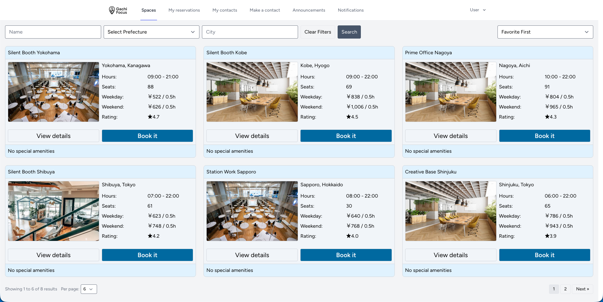
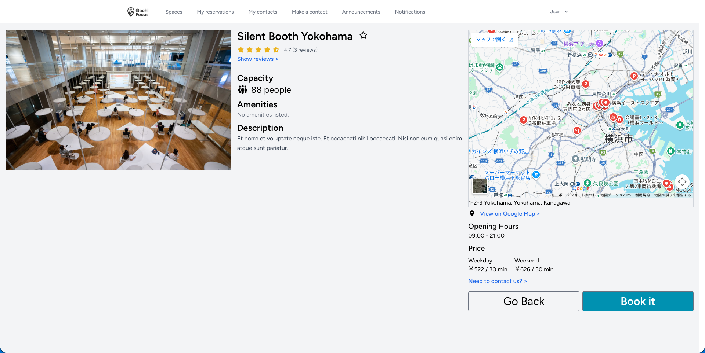
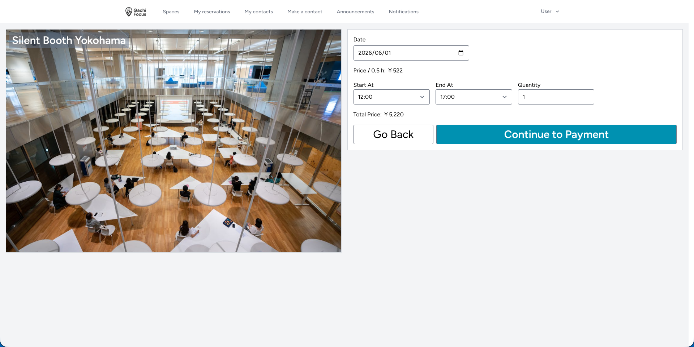
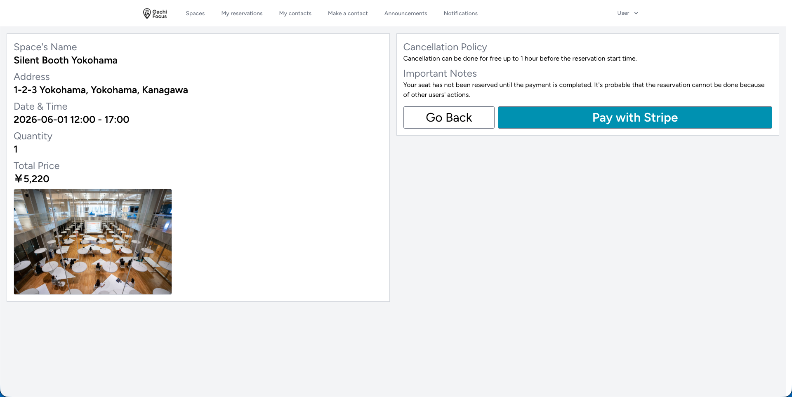
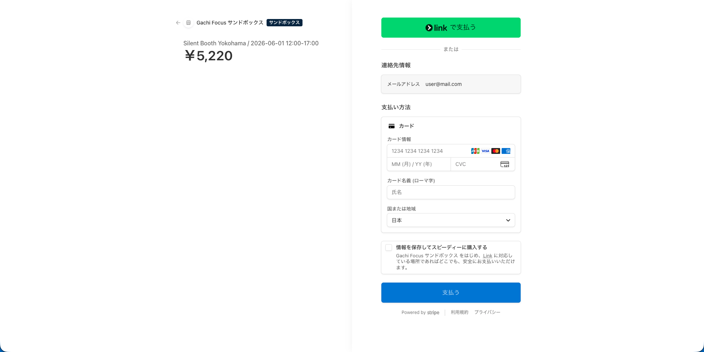
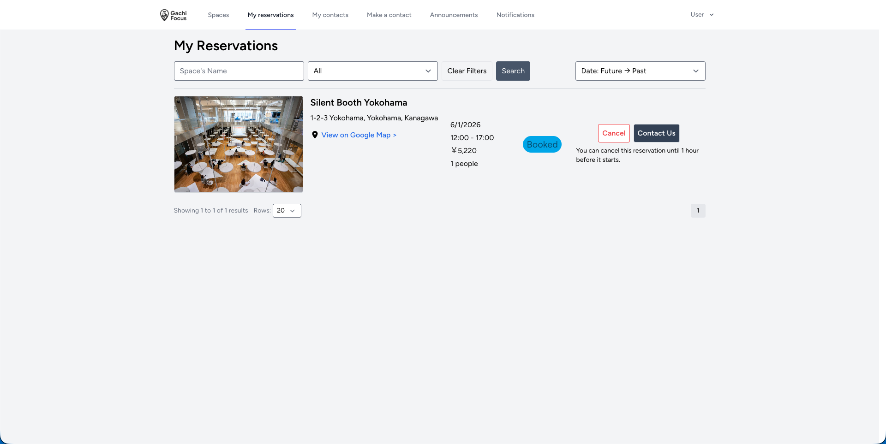
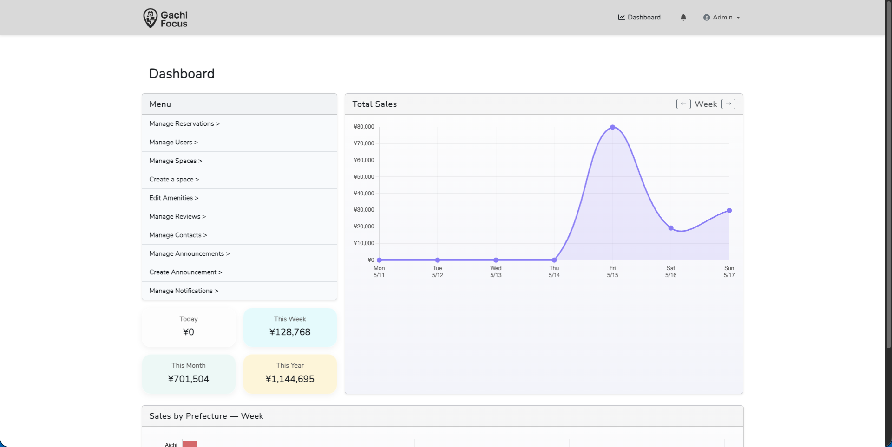
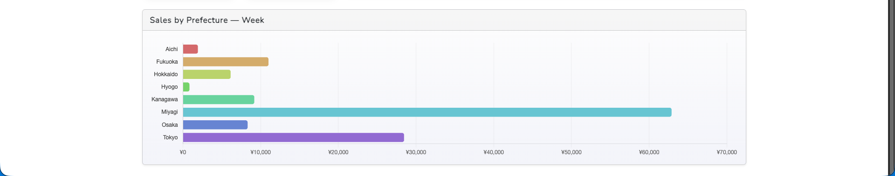
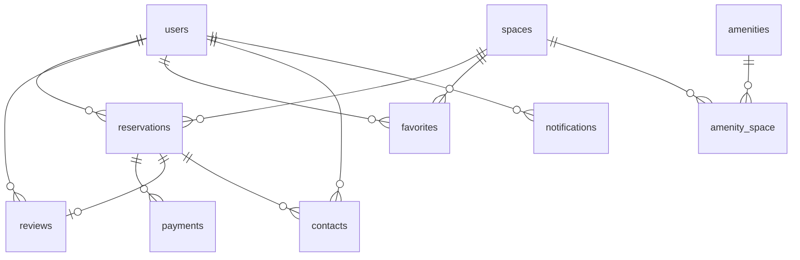
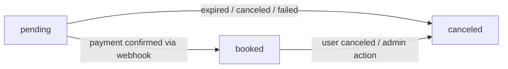

# Gachi Focus

## Overview

A web application for coworking space management and reservation. Users can search for spaces, make reservations, and pay online. Admins can manage spaces, users, reservations, reviews, contacts, and notifications from a dedicated dashboard.

This project is designed as an MVP, focusing on core functionality with room for scalability and future improvement.

---

## Screenshots





### Reservation Flow

| | |
|---|---|
|  |  |
|  |  |

### Admin Dashboard





---

## Live Demo

**[https://gachi-focus.up.railway.app/login](https://gachi-focus.up.railway.app/login)**

| Role | Email | Password |
| --- | --- | --- |
| Admin | admin@mail.com | admin12345 |
| User | user@mail.com | user12345 |

---

## Setup

```bash
git clone https://github.com/2630-Daichi-Inoue/Gachi_Focus
cd Gachi_Focus

composer install
npm install

cp .env.example .env
php artisan key:generate
```

Configure the following in `.env`:

```env
DB_DATABASE=your_database
DB_USERNAME=your_username
DB_PASSWORD=your_password

STRIPE_KEY=pk_test_...
STRIPE_SECRET=sk_test_...
STRIPE_WEBHOOK_SECRET=whsec_...
```

```bash
php artisan migrate --seed
npm run dev
php artisan serve
```

To test Stripe webhooks locally (requires [Stripe CLI](https://stripe.com/docs/stripe-cli)):

```bash
stripe listen --forward-to localhost:8000/stripe/webhook
```

To also test automatic expiration locally (optional): `php artisan schedule:work`

---

## Tech Stack

| Layer | Technology |
| --- | --- |
| Backend | Laravel 11 |
| Frontend | Vue 3 / Inertia.js / Tailwind CSS |
| Payment | Stripe Checkout (server-side, hosted page) |
| Database | MySQL (ULID primary keys) |
| PHP Formatting | Laravel Pint (PSR-12) ✅ |
| JS/Vue Formatting | Prettier + prettier-plugin-tailwindcss ✅ |
| Testing | PHPUnit 🔲 Planned |
| Static Analysis | Larastan 🔲 Planned |

---

## Key Features

### User
- Space search with filters (name, prefecture, city, max price) and sorting (rating, price, capacity, favorites-first)
- Reservation flow: time slot selection → confirmation → Stripe payment
- Free cancellation up to 1 hour before start time, with automatic refund
- Review submission, editing, and soft deletion
- Contact form submission and status tracking
- View notifications and announcements made by admin

### Admin
- Space CRUD with public/hidden toggle
- User management with three statuses:
  - `active`: full access
  - `restricted`: cannot make reservations or post new reviews; existing reviews hidden
  - `banned`: all restrictions of restricted apply; additionally cannot log in and future reservations are auto-canceled with refund
- Future reservations auto-canceled with refund on space deletion
- Review, contact, and notification management
- Dashboard with revenue aggregations by day, week, month, year, and prefecture

---

## ER Diagram



---

## Reservation Status Lifecycle



Both `pending` and `booked` reservations occupy the slot in overlap checks to prevent double-booking.

| Status | Meaning |
| --- | --- |
| `pending` | Reservation created, awaiting payment (slot held) |
| `booked` | Payment confirmed by Stripe webhook |
| `canceled` | Payment expired / user canceled / admin action |

---

## Payment Flow

```
POST reservations.store
  → Availability check → Create Reservation (pending) → Redirect to payments.checkout

GET payments.checkout
  → Re-check with lockForUpdate → Create Stripe Session (30 min) → Redirect to Stripe

Stripe Checkout (Stripe-hosted)
  ↓ success → reservations.index (ok flash)
  ↓ cancel  → Payment: canceled, Reservation stays pending (retry possible)

Webhook → payments.webhook
  checkout.session.completed    → Reservation: booked,   Payment: paid
  checkout.session.expired      → Reservation: canceled, Payment: expired
  payment_intent.payment_failed → Payment: failed (reservation stays pending)

Artisan: payments:expire-pending (every minute — fallback for missed webhooks)
  → Payments pending > 30 min → Payment: expired, Reservation: canceled
```

> Payment confirmation relies solely on the Stripe webhook (`checkout.session.completed`);
> the success redirect is cosmetic and does not confirm payment.

---

## Technical Highlights

### Backend
- **Race condition prevention**: concurrent reservation requests can pass the availability check simultaneously before either is committed — mitigated by wrapping creation in a DB transaction with `lockForUpdate()` on the Space row, forcing sequential capacity checks
- **Rate limiting**: the contact form is vulnerable to spam and excessive submissions — `throttle` middleware limits request frequency per user
- **Refund flow**: `Refund::create()` runs outside the DB transaction to avoid holding row locks during the Stripe API call; on failure, a notification and auto-generated admin contact are created for manual processing, with `charge.refunded` webhook as a fallback for process crashes between the API call and the local DB update
- **Pending reservation as retry slot**: on payment cancel or failure, the reservation stays `pending` rather than being immediately canceled, allowing the user to retry payment without recreating the reservation; the slot is released automatically after 30 minutes via a scheduled command

### Frontend
- **Double submission prevention**: slow networks or repeated clicks can cause duplicate records — all forms use `useForm` with `form.processing` to disable the submit button while a request is in flight

### Access Control
- Sensitive endpoints protected by middleware + FormRequest authorization
- User status restrictions enforced server-side regardless of frontend state

---

## Future Prospects

- **Internationalization**: timezone, locale, and multi-currency support (`currency` column already provisioned in payments table)
- **Testing**: E2E tests covering reservation → cancel → review flows and edge cases
- **Multi-image support** for spaces
- **Space availability visualization** (calendar view)
- **Admin reply feature** for contacts
- **Reservation history dashboard** for users
