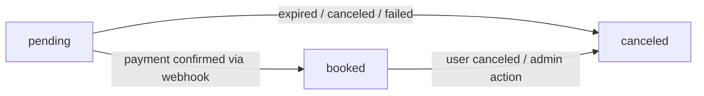

# Gachi Focus

## Overview

A web application for coworking space management and reservation. Users can search for spaces, make reservations, and pay online. Admins can manage spaces, users, reservations, reviews, contacts, and notifications from a dedicated dashboard.

This project is designed as an MVP, focusing on core functionality with room for scalability and future improvement.

---

## Setup

```bash
git clone <repository-url>
cd gachi-focus

composer install
npm install

cp .env.example .env
php artisan key:generate
```

Configure the following in `.env`:

```env
DB_DATABASE=your_database
DB_USERNAME=your_username
DB_PASSWORD=your_password

STRIPE_KEY=pk_test_...
STRIPE_SECRET=sk_test_...
STRIPE_WEBHOOK_SECRET=whsec_...
```

```bash
php artisan migrate --seed
npm run dev
php artisan serve
```

To test Stripe webhooks locally (requires [Stripe CLI](https://stripe.com/docs/stripe-cli)):

```bash
stripe listen --forward-to localhost:8000/stripe/webhook
```

To also test automatic reservation expiration (optional — Stripe CLI covers the normal expiry path via webhook):

```bash
php artisan schedule:work
```

---

## Tech Stack

| Layer | Technology |
| --- | --- |
| Backend | Laravel 11 |
| Frontend | Vue 3 / Inertia.js / Tailwind CSS |
| Payment | Stripe Checkout (server-side, hosted page) |
| Database | MySQL (ULID primary keys) |
| Code Quality | Prettier + prettier-plugin-tailwindcss |

---

## Key Features

### User
- Space search with filters (name, prefecture, city, max price) and sorting (rating, price, capacity, favorites-first)
- Reservation flow: time slot selection → confirmation → Stripe payment
- Free cancellation up to 1 hour before start time, with automatic refund
- Review submission, editing, and soft deletion
- Contact form submission and status tracking
- View notifications and announcements made by admin

### Admin
- Space CRUD with public/hidden toggle
- User management with three statuses:
  - `active`: full access
  - `restricted`: cannot make reservations or post new reviews; existing reviews hidden
  - `banned`: all restrictions of restricted apply; additionally cannot log in and future reservations are auto-canceled with refund
- Future reservations auto-canceled with refund on space deletion
- Review, contact, and notification management
- Dashboard with revenue aggregations by day, week, month, year, and prefecture

---

## Reservation Status Lifecycle



Both `pending` and `booked` reservations occupy the slot in overlap checks to prevent double-booking.

| Status | Meaning |
| --- | --- |
| `pending` | Reservation created, awaiting payment (slot held) |
| `booked` | Payment confirmed by Stripe webhook |
| `canceled` | Payment expired / user canceled / admin action |

---

## Payment Flow

```
User clicks "Pay with Stripe"
    ↓ POST → reservations.store
      - Availability check (booked + pending)
      - Create Reservation (status: pending)
      - Redirect to payments.checkout
    ↓ GET → payments.checkout
      - If active pending Payment exists → redirect to existing Stripe session
      - Re-check availability with DB lock (lockForUpdate)
      - Create Stripe Checkout Session (expires in 30 min)
      - Create Payment record (status: pending)
      - Redirect to Stripe

Stripe Checkout (Stripe-hosted)
    ↓ success                    ↓ cancel
payments.success             payments.cancel
    ↓                            ↓
reservations.index           Payment: canceled
(ok flash)                   Reservation stays pending temporarily (retry possible until expiration)
                             reservations.index (warning flash)

Stripe Webhook → payments.webhook
  checkout.session.completed   → Reservation: booked, Payment: paid
  checkout.session.expired     → Reservation: canceled, Payment: expired
  payment_intent.payment_failed → Payment: failed (reservation stays pending)

Artisan: payments:expire-pending (runs every minute, fallback for missed webhooks)
  → Payments pending > 30 min → Payment: expired, Reservation: canceled
```

> Payment confirmation relies solely on the Stripe webhook (`checkout.session.completed`);
> the success redirect is cosmetic and does not confirm payment.

---

## Technical Highlights

### Backend
- **Race condition prevention**: concurrent reservation requests can pass the availability check simultaneously before either is committed — mitigated by wrapping creation in a DB transaction with `lockForUpdate()` on the Space row, forcing sequential capacity checks
- **FormRequest**: validation and authorization separated into dedicated FormRequest classes; `authorize()` handles both authentication and user status checks
- **Soft deletes**: applied to User, Space, and Review; related records remain accessible via `withTrashed()`
- **Model helpers and scopes**: `isRestricted()`, `isBanned()`, `isPublic()`, `Space::public()` etc. centralize status checks and keep controllers clean
- **Shared sort logic**: `AppliesChronologicalSort` trait eliminates duplicated sort boilerplate across controllers
- **Rate limiting**: the contact form is vulnerable to spam and excessive submissions — `throttle` middleware limits request frequency per user
- **Refund flow**: `Refund::create()` is intentionally executed outside the DB transaction to avoid holding row locks during slow external API calls. The reservation is first marked `canceled` and the payment `refund_pending`; if the Stripe call fails, a notification and auto-generated admin contact are created for manual processing. The `charge.refunded` webhook acts as a fallback if the process crashes between the Stripe API call and the local DB update.
- **Pending reservation as retry slot**: on payment cancel or failure, the reservation stays `pending` rather than being immediately canceled, allowing the user to retry payment without recreating the reservation; the slot is released automatically after 30 minutes via a scheduled command

### Frontend
- **Inertia.js `useForm`**: double submission on slow networks or repeated clicks can cause duplicate records — all forms use `useForm` with `form.processing` to disable the submit button while a request is in flight
- **Inline error display**: action errors (cancel, delete, etc.) shown as inline messages instead of browser `alert()`
- **Conflict warning**: users are warned and asked to confirm if a new reservation overlaps with an existing one

### Access Control
- Backend guards on all sensitive endpoints regardless of frontend state (URL-direct-access proof)
- Admin routes protected by `auth` + `admin` middleware; `authorize()` in FormRequests as an additional layer
- User status enforced in both middleware and FormRequest `authorize()` to prevent bypass

---

## Code Quality

| Tool | Purpose | Status |
| --- | --- | --- |
| Laravel Pint | PHP code style (PSR-12) | ✅ Applied |
| Prettier + prettier-plugin-tailwindcss | Vue / JS formatting + Tailwind class sorting | ✅ Applied |
| PHPUnit | Feature and unit tests | 🔲 Planned |
| Larastan | Static analysis (PHPStan for Laravel) | 🔲 Planned |

---

## Future Prospects

- **Internationalization**: timezone, locale, and multi-currency support (`currency` column already provisioned in payments table)
- **Testing**: E2E tests covering reservation → cancel → review flows and edge cases
- **Multi-image support** for spaces
- **Space availability visualization** (calendar view)
- **Admin reply feature** for contacts
- **Reservation history dashboard** for users
